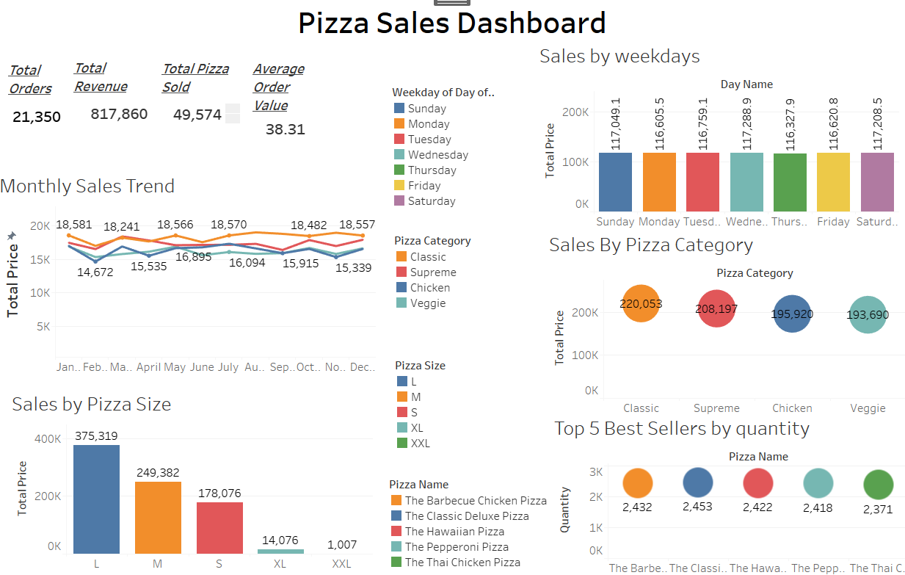
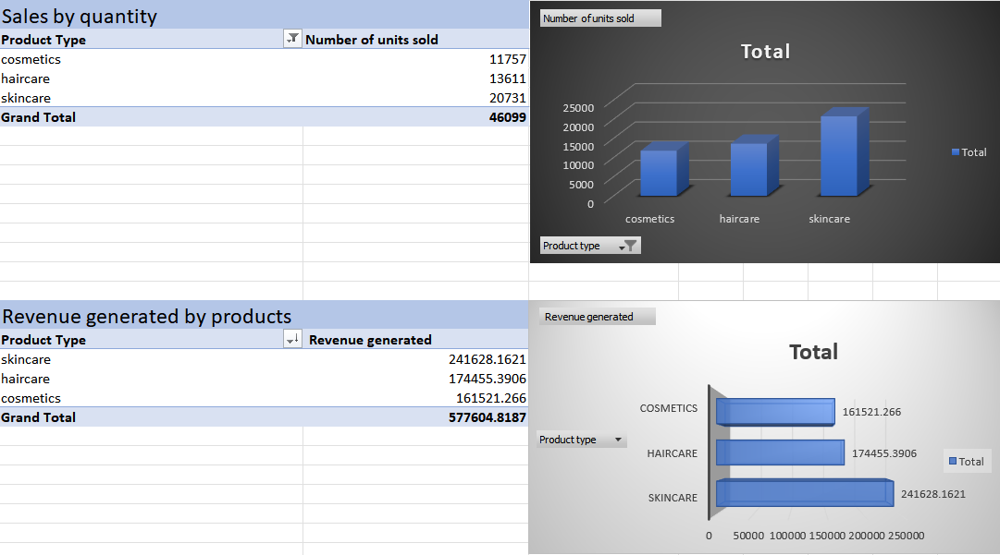
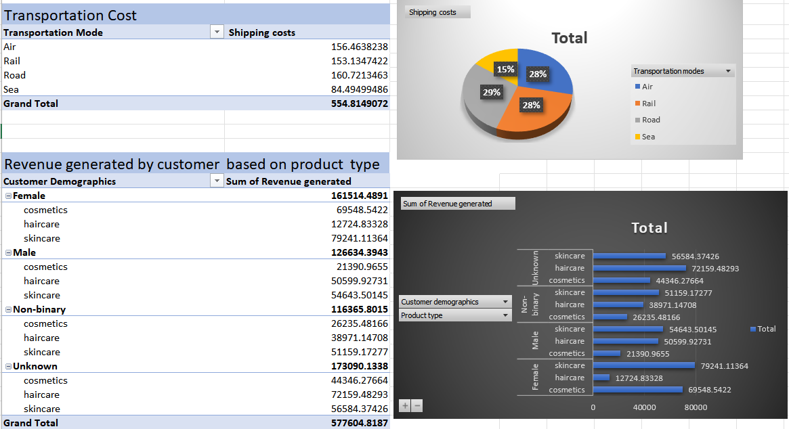
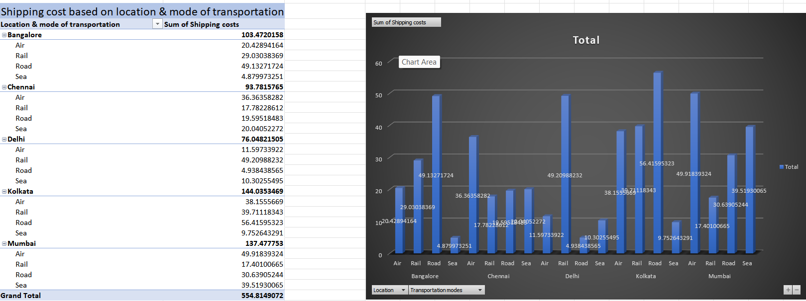

# Supply-Chain-Management-Analysis
End-to-end supply chain analysis using Excel, SQL & Power BI to uncover operational insights and improve efficiency.
# 🚚 Supply Chain Dashboard Analysis

Comprehensive supply chain performance analysis using **Excel**, **SQL**, and **Power BI** to identify operational inefficiencies, track key logistics KPIs, and support data-driven decision-making.

---

## 📌 Project Overview

This project analyzes key aspects of a supply chain system to uncover trends, inefficiencies, and optimization opportunities. The dataset includes information on shipping costs, supplier performance, delivery timelines, and regional logistics.

An interactive **Power BI dashboard** was created to visualize the findings and deliver actionable insights.

---

## 🎯 Objectives

- Track key KPIs such as shipping cost, delivery timelines, and supplier performance  
- Identify cost-saving opportunities across locations and products  
- Compare performance across regions and fulfillment centers  
- Provide data-driven recommendations to enhance supply chain efficiency  

---

## 🧰 Tools & Technologies

| Tool        | Purpose                                      |
|-------------|----------------------------------------------|
| **Excel**   | Data cleaning, formatting, and pivot analysis |
| **SQL**     | Data extraction, transformation, KPI logic   |
| **Power BI**| Dashboard design and interactive visualization |

---

---

## 📸 Additional Visuals & Analysis

### 📍 Supply Chain Dashboard Overview

---

### 📍 Sales & Revenue Chart

---

### 📍 Supporting Excel Pivot Charts

---

### 📍 Location-wise Shipping Cost Pivot

---

## 📂 Project Presentation

📽️ A downloadable PowerPoint presentation summarizing all key insights and visualizations:

➡️ [Download Supply Chain Dashboard Analysis PPTX](Supply_chain_Dashboar_Analysis.pptx)

---

## 🔍 Key Insights

- 🚚 **Shipping Cost**: Higher in remote locations; regional hub optimization is recommended  
- 📦 **Order Processing Time**: Peaks during weekends — workforce balancing can improve flow  
- 🏆 **Top Suppliers**: A small number of suppliers contribute to the majority of deliveries — monitor dependency risk  
- 🌍 **Regional Trends**: Western zone consistently achieves faster delivery SLAs  

---

## 📂 Project Structure

Supply-Chain-Dashboard-Analysis/
│
├── Excel/ # Data cleanup and summaries
├── SQL/ # SQL queries for insights
├── PowerBI/ # Power BI .pbix file and visuals
├── Presentation/ # Final PowerPoint presentation
├── supply chain dashboard preview.png # Dashboard screenshot
└── README.md # This file

yaml
Copy
Edit

---

## 📫 Contact

**Shashank Bajpai**  
📧 [shashankax0@gmail.com]  
🔗 [LinkedIn](www.linkedin.com/in/shashank-bajpai-53871222a)

---

> ⭐ *Feel free to fork this repo, give it a star, or reach out on LinkedIn for fee
> supply%20chain%20dashboard%20preview.png.png
